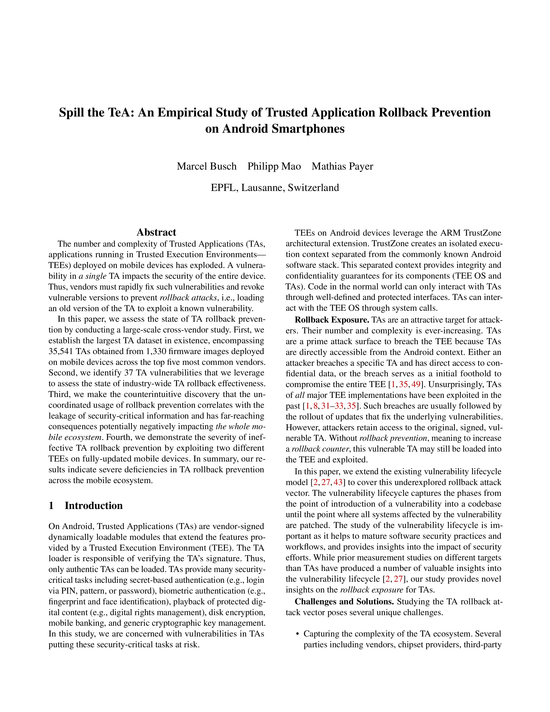

# Spill the TeA: An Empirical Study of Trusted Application Rollback Prevention on Android Smartphones

<a href="http://hexhive.epfl.ch/publications/files/24SEC2.pdf">  </a>

This repository contains the artifacts for our USENIX SEC'24 paper <a href="http://hexhive.epfl.ch/publications/files/24SEC2.pdf">Spill the TeA: An Empirical Study of Trusted Application Rollback Prevention on Android Smartphones</a>.

If you use our artifacts or want to refer to "Spill the TeA" in a scientific publication, we would appreciate a citation using this Bibtex entry: 

```
@inproceedings{busch2024spillthetea,
  author       = {Marcel Busch and
                  Philipp Mao and
                  Mathias Payer},
  title        = {Spill the TeA: An Empirical Study of Trusted Application Rollback Prevention on Android Smartphones},
  booktitle    = {33st {USENIX} Security Symposium, {USENIX} Security 2024, Philadelphia,
                  PA, USA, August 14-16, 2024},
  publisher    = {{USENIX} Association},
  year         = {2024},
  url          = {https://www.usenix.org/conference/usenixsecurity24/presentation/busch}
}
```

## SETUP :wrench:

```bash
cd <repo base>
virtualenv -p python3.10 .venv
. .venv/bin/activate
pip install -r requirements.txt
export PYTONPATH=<repo base>
```

## STORAGE

Configured in `data/config.py`, by default firmware is stored in `/fw`.

Folder structure:

```
/fw/<vendor>/<model>[/<region>]/<fw_version>/
                                  metadata.json (fw info)
                                  report.json (optional, TA version)
                                  <fw_version>/tas (extracted TAs)
```

See `data/firmware.txt` for the complete list of firmware used in our study.
Note that for `oppo`, `vivo`, and `transsien` (`tecno`)  the `region` is not present.

## Firmware Origin

For this project, we collected multiple terabytes of firmware images from the following sources.

| Vendor   | Firmware Repository        |
| :---             |    :----:          |
| Xiaomi      | https://xmfirmwareupdater.com/ |
|| https://xiaomifirmwareupdater.com/ |
| Samsung      | https://samfw.com/ |
| | https://www.sammobile.com/firmwares |
| Oppo      |   https://oppostockrom.com/ |
||  https://www.gsmmafia.com/oppo-flash-file/ |
|| https://mobifirmware.com/category/oppo-firmware/ |
| Vivo      | https://vivofirmware.com/ |
|| https://www.gsmmafia.com/vivo-flash-file/ |
|| https://mobifirmware.com/category/vivo-firmware/ |
| Tecno      | https://firmwaredrive.com/ |
|| https://www.mediafire.com/ |

## HOWTO

This repo contains vendor/platform-specific extractor scripts that automate the process of obtaining TA binaries from firmware images and parsing metadata from these TAs.

To extract TAs from a firmware image, you can use the vendor-/platform-specific `*extracttas.py` scripts:
```
./samsung/qualcomm/extracttas.py
./samsung/kinibi/extracttas.py
./samsung/teegris/extracttas.py
./other_vendors/transsien/mtk_bp_extracttas.py
./other_vendors/oppo/qc_extracttas.py
./other_vendors/oppo/mtk_kinibi_extracttas.py
./other_vendors/vivo/qc_extracttas.py
./other_vendors/vivo/mtk_kinibi_extracttas.py
./xiaomi/qualcomm/extracttas.py
./xiaomi/mediatek/extracttas.py
```

To parse the TA binary headers, you can use the TEE-specific `*parse.py` scripts:

```
./samsung/qualcomm/parse.py
./samsung/kinibi/parse.py
./samsung/teegris/parse.py
./other_vendors/oppo/qc_parse.py
./other_vendors/oppo/mtk_kinibi_parse.py
./other_vendors/vivo/qc_parse.py
./other_vendors/vivo/mtk_kinibi_parse.py
./xiaomi/qualcomm/parse.py
```

### Example 1: Xiaomi Redmi 9A (dandelion/beanpod)

Download `dandelion_global_images_V12.0.15.0.QCDMIXM_20210701.0000.00_10.0_global_f2aa7fee5c.tgz` from https://xmfirmwareupdater.com/miui/dandelion/stable/V12.0.15.0.QCDMIXM/.

Organize images as described above:

```
# /fw/<vendor>/<model>[/<region>]/<fw_version>/
/fw/xiaomi/dandelion/global/V12.0.15.0.QCDMIXM/dandelion_global_images_V12.0.15.0.QCDMIXM_20210701.0000.00_10.0_global_f2aa7fee5c.tgz
```

Run the vendor/platform-specific extractor:
```
$ sudo python xiaomi/mediatek/extracttas.py --tas -f /fw/xiaomi/dandelion/global/V12.0.15.0.QCDMIXM/dandelion_global_images_V12.0.15.0.QCDMIXM_20210701.0000.00_10.0_global_f2aa7fee5c.tgz -o /fw/xiaomi/dandelion/global/V12.0.15.0.QCDMIXM/
```

After extraction, there should be a directory containing the TAs:
```
$ ls /fw/xiaomi/dandelion/global/V12.0.15.0.QCDMIXM/V12.0.15.0.QCDMIXM/tas/
08010203000000000000000000000000.ta
14498ace2a8f11e880c8509a4c146f4c.ta
3d08821c33a611e6a1fa089e01c83aa2.ta
86f623f6a2994dfdb560ffd3e5a62c29.ta
c09c9c5daa504b78b0e46eda61556c3a.ta
c1882f2d885e4e13a8c8e2622461b2fa.ta
d78d338b1ac349e09f65f4efe179739d.ta
d91f322ad5a441d5955110eda3272fc0.ta
e5140b3376fa4c63ab18062caab2fb5c.ta
```

The beanpod TEE used on this device does not support rollback counters, which is why we omit the parsing step.

### Example 2: Samsung Galaxy S10 (SM-G973F/TEEgris)

Download `SAMFW.COM_SM-G973F_XXV_G973FXXUFHVG4_fac.zip` from https://samfw.com/firmware/SM-G973F/XXV/G973FXXUFHVG4.

Organize images as described above:

```
# /fw/<vendor>/<model>[/<region>]/<fw_version>/
/fw/samsung/SM-G973F/XXV/G973FXXUFHVG4/SAMFW.COM_SM-G973F_XXV_G973FXXUFHVG4_fac.zip
```

Run the vendor/platform-specific extractor:
```
$ sudo python samsung/teegris/extracttas.py --tas -f /fw/samsung/SM-G973F/XXV/G973FXXUFHVG4/SAMFW.COM_SM-G973F_XXV_G973FXXUFHVG4_fac.zip -o /fw/samsung/SM-G973F/XXV/G973FXXUFHVG4/G973FXXSEGVA9
```

After extraction, there should be a directory containing the TAs:
```
$ ls /fw/samsung/SM-G973F/XXV/G973FXXUFHVG4/G973FXXUFHVG4/tas
00000000-0000-0000-0000-000000010081
00000000-0000-0000-0000-000000020081
00000000-0000-0000-0000-000000534b4d
00000000-0000-0000-0000-000048444350
00000000-0000-0000-0000-0000534b504d
00000000-0000-0000-0000-0050524f4341
00000000-0000-0000-0000-00535453540b
00000000-0000-0000-0000-0053545354ab
00000000-0000-0000-0000-00575644524d
00000000-0000-0000-0000-42494f535542
00000000-0000-0000-0000-446e6c6f6164
00000000-0000-0000-0000-46494e474502
00000000-0000-0000-0000-474154454b45
00000000-0000-0000-0000-4b45594d5354
00000000-0000-0000-0000-4d53546d7374
00000000-0000-0000-0000-505256544545
00000000-0000-0000-0000-5345435f4652
00000000-0000-0000-0000-53454d655345
00000000-0000-0000-0000-535355504341
00000000-0000-0000-0000-5354494d4552
00000000-0000-0000-0000-53626f786476
00000000-0000-0000-0000-564c544b4456
00000000-0000-0000-0000-564c544b5052
00000000-0000-0000-0000-64756c444152
00000000-0000-0000-0000-656e676d6f64
00000000-0000-0000-0000-657365447276
00000000-0000-0000-0000-657365636f6d
00000000-0000-0000-0000-6d73745f5441
ffffffff-0000-0000-0000-000000000030
```

Parse the TA headers and extract rollback info:
```
$ python samsung/teegris/parse.py -t /fw/samsung/SM-G973F/XXV/G973FXXUFHVG4/ -j /fw/samsung/SM-G973F/XXV/G973FXXUFHVG4/report.json

# view the TA metadata
$ cat /fw/samsung/SM-G973F/XXV/G973FXXUFHVG4/report.json | python -m json.tool
```

## Create Aggregated Report

We provide the metadata for all firmware images in this repository under
`./fw`.  This metadata consists of `{metadata,report}.json` files and the
directory structure of our dataset with empty files itself.  Unfortunatly, we
cannot distribute proprietary binaries.

To run the aggrregation script, create a softlink in root to `./fw`:
```
sudo ln -fs `pwd`/fw /
```

Run aggregation script:
```
PYTHONPATH=`pwd` python3 paper_scripts/gen_number_better.py
```

